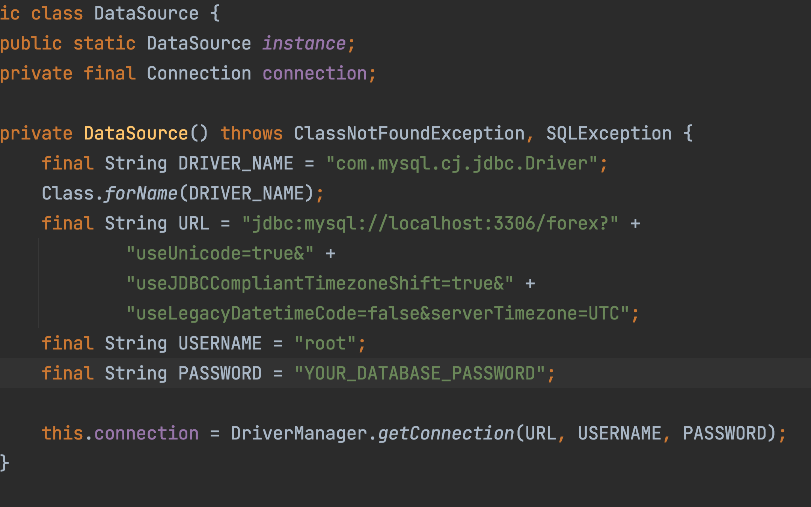
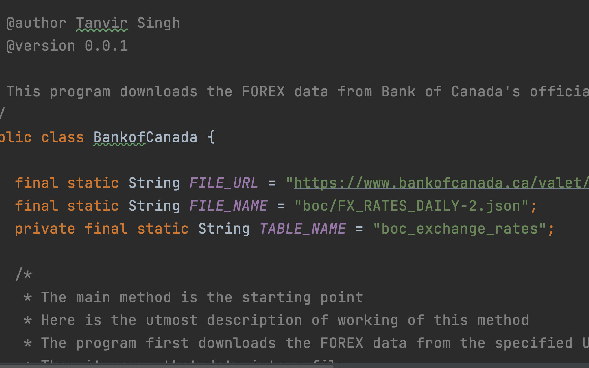

# Bank of Canada
This program downloads the latest exchange rates from the Bank of Canada and stores that data into a specified entity or table name "boc_exchange_rates"

### Table of Contents:
[Installation](#installation)
<br>
[Usage](#usage)
<br>
[Contributing](#contributing)
<br>
[Credits](#credits)
<br>
[License](#license)

<h3 id="installation">
Installation
</h3>
Before installation, I would like to suggest that if you can create a database named forex on your localhost machine and create a table named boc_exchange_rates with the following DDL provided below then this program should not show any unexpected errors regarding the data source.
<br>

```sql
CREATE TABLE `boc_exchange_rates` (
  `symbol` varchar(250) NOT NULL,
  `rate` double DEFAULT NULL,
  PRIMARY KEY (`symbol`)
) ENGINE=InnoDB DEFAULT CHARSET=utf8mb4 COLLATE=utf8mb4_0900_ai_ci
```
Steps to configure custom data source and configure a different table name are mentioned in the [Usage](#usage) section

Now we are all done with the prerequisites lets jump to the installation part


In order to create a JAR for this project, the process is pretty straightforward
Simple go into the project directory and run the following:

```bash
mvn package
```
This will automatically create a JAR file in the directory
/target

<h3 id="usage">
Usage
</h3>
This program is intended to run as a JAR file although it can also run without creating an archive directly from the classes.

<br>
In order to run the jar file we simply have to navigate to the directory where the JAR is created, which in this case is /target
and simply run the following command:

```bash
java -jar ca.bankofcanada-1.0-SNAPSHOT.jar
```

This is all we need to run this program it will download and persist the data into the specified entity i.e. boc_exchange_rates

In order to configure a custom data source
let's deep into the source code a bit
It established the connection using JDBC
so if we navigate ourselves to the package
ca.bankofcanada.sql
here we can find all the classes which are related to the SQL functionality.
By opening the class DataSource.java we can see inside the constructor where the properties are defined.

Please refer to the image below if you are having difficulties finding the constant



Just a side note: This class uses a singleton design pattern to ensure that only one connection at a time is established.

To change the table name we simply have to navigate the main class which in our case is BankofCanada.java and is located in the topmost package i.e ca.bankofcanada
Just in the starting, we can see the constant named TABLE_NAME
we simply have to change the name according to the requirements

Please refer to the image below if you are having difficulties finding the constant



<h3 id="contributing">
Contributing
</h3>
This project is open to contribution, but before pushing the modified or changed source code please leave an email to the author at singhtanvir525@gmail.com

<h3 id="credits">
Credits
</h3>
Data providers:
Bank of Canada

<h3 id="license">
License
</h3>
The content of this project and the underlying source code used is licensed under the MIT license.
